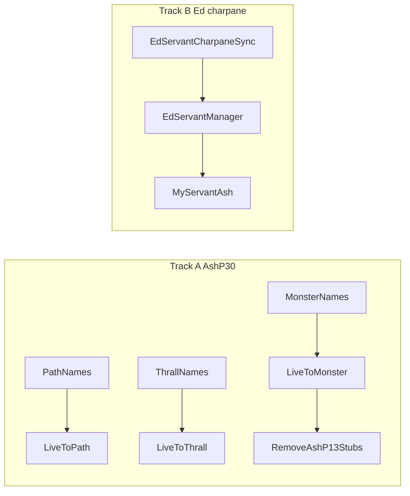

# Phase 66: AshP30 MONSTER/PATH/THRALL + Ed charpane sync

> **For agentic workers:** REQUIRED SUB-SKILL: Use superpowers:subagent-driven-development (recommended) or superpowers:executing-plans to implement this plan task-by-task. Steps use checkbox (`- [ ]`) syntax for tracking.

**Goal:** Continue Tier 1 after Phase 65 (`REVISION = "phase65"`, 1,902 tests). Close remaining pass-through `to_monster`/`to_path`/`to_thrall` string converters and deliver deferred Ed servant charpane sync so `have_servant` / `my_servant` reflect live game state.

**Status:** Complete (`GameRuntimeLibrary.REVISION = "phase66"`)

**Architecture:** Track A adds thin name resolvers (mirroring AshP27–AshP29) and wires live `to_*` overloads where AshP9 / `registerTypeConversions` / `registerBanishQueries` currently pass strings through unchanged. Track B ports desktop `CharPaneRequest.checkServant` patterns into a small sync helper hooked from charpane fetch paths, updating `EdServantManager` prefs. AshP11 already owns live `is_valid` for LOCATION/MONSTER/THRALL/PATH — AshP13 blank stubs are dead code and get removed.

**Tech Stack:** Kotlin Multiplatform (`shared/commonMain` + `commonTest`), `ModifierDatabase` / `MonsterDatabase`, `EdServantManager`, `./gradlew.bat :shared:jvmTest`, `./gradlew.bat :androidApp:assembleDebug`, `GameRuntimeLibrary.REVISION = "phase66"`.

**Authority:** [`docs/parity-audit.md`](docs/parity-audit.md) Tier 1 #1 (ASH behavioral / `to_*` resolvers) and Tier 1 #2 (Ed servant runtime depth deferred from Phase 65).

---

## Track A — AshP30 MONSTER/PATH/THRALL `to_*` resolvers

AshP11 already registers live `is_valid` for `LOCATION`/`MONSTER`/`THRALL`/`PATH`. AshP13 still registers blank `isNotBlank()` overloads that never win — remove them. The real gap is **string `to_*` converters** still returning raw input:

| Current site | Function | Behavior today |
| ------------ | -------- | -------------- |
| `GameRuntimeLibrary.AshP9Batch.kt` | `to_monster(name)` | pass-through (wins over banish batch) |
| `GameRuntimeLibrary.kt` `registerTypeConversions` | `to_path`, `to_thrall` | pass-through |
| `GameRuntimeLibrary.kt` `registerBanishQueries` | `to_monster(name)` | dead duplicate (AshP9 wins) |

### 1. Data resolvers

**[`modifiers/MonsterNames.kt`](shared/src/commonMain/kotlin/net/sourceforge/kolmafia/modifiers/MonsterNames.kt)** (new):
- `resolve(name: String): String?` — `MonsterDatabase.getByName` (requires DB loaded); optional numeric id → `getById`
- `isValid(name: String): Boolean`
- Inject via `GameRuntimeLibrary.gameDatabase` in handlers (same pattern as AshP11 `monster(ref)`)

**[`modifiers/PathNames.kt`](shared/src/commonMain/kotlin/net/sourceforge/kolmafia/modifiers/PathNames.kt)** (new):
- `resolve(name: String): String?` — `ModifierDatabase.getPath` (case-insensitive) canonical `ModifierEntry.name`; fallback `AscensionPath.fromApiString(s).apiString` when path has modifier data
- `isValid(name: String): Boolean`

**[`modifiers/ThrallNames.kt`](shared/src/commonMain/kotlin/net/sourceforge/kolmafia/modifiers/ThrallNames.kt)** (new):
- `resolve(name: String): String?` — `ModifierDatabase.getThrall` canonical name
- `isValid(name: String): Boolean`

### 2. Live `to_*` wiring

- **`GameRuntimeLibrary.AshP9Batch.kt`** — `to_monster(name)` → `MonsterNames.resolve()` via `gameDatabase`; empty string when invalid
- **`GameRuntimeLibrary.kt`** — `to_path` / `to_thrall` in `registerTypeConversions` use `PathNames` / `ThrallNames`
- **`GameRuntimeLibrary.kt`** — remove duplicate pass-through `to_monster` from `registerBanishQueries` (or delegate to same resolver to avoid drift)
- Optional **`GameRuntimeLibrary.AshP30Batch.kt`** — register only if needed for overload parity; otherwise skip empty batch file

### 3. Remove AshP13 dead stubs

In [`GameRuntimeLibrary.AshP13Batch.kt`](shared/src/commonMain/kotlin/net/sourceforge/kolmafia/ash/GameRuntimeLibrary.AshP13Batch.kt), delete `stubEntityTypes` loop entirely (`LOCATION`/`MONSTER`/`THRALL`/`PATH`).

### 4. Tests + corpus

- New [`GameRuntimeLibraryAshP30Test.kt`](shared/src/commonTest/kotlin/net/sourceforge/kolmafia/ash/GameRuntimeLibraryAshP30Test.kt): `to_monster`/`to_path`/`to_thrall` round-trips; bogus names → empty string; `is_valid` still true for known entities (AshP11)
- Extend [`AshCompatibilityCorpusTest.kt`](shared/src/commonTest/kotlin/net/sourceforge/kolmafia/ash/AshCompatibilityCorpusTest.kt) with `corpus_monsterPathThrallEntity_live` snippets using canonical names from bundled data

---

## Track B — Ed servant charpane sync (v1)

Phase 65 shipped switch-only `EdServantManager`. Desktop parses charpane for active servant ([`CharPaneRequest.checkServant`](C:/Development/kolmafia/kolmafia/src/net/sourceforge/kolmafia/request/CharPaneRequest.java)).

### 1. Charpane parser

New [`servant/EdServantCharpaneSync.kt`](shared/src/commonMain/kotlin/net/sourceforge/kolmafia/servant/EdServantCharpaneSync.kt):
- Port compact + expanded regex patterns from desktop (`edservN.gif`, level capture)
- Map servant id → `ServantData` type; update `ACTIVE_SERVANT_PREF`
- If HTML contains summoned-servant table markers, append types to `SERVANTS_PREF` (best-effort; fixture-driven)

### 2. Hook sync points

- **`EdServantManager`** — `syncFromCharpane(html: String)` delegating to parser
- **`GameRuntimeLibrary.kt`** — after `visitKolPage("charpane.php")` / `refresh` charpane fetch, call `edServantManager?.syncFromCharpane(html)` when Ed path
- Reuse existing HTTP charpane fetch in refresh path (grep `charpane.php`); avoid duplicate requests in one CLI call

### 3. ASH alignment

- **`GameRuntimeLibrary.AshP10Batch.kt`** — `my_servant()` returns `edServantManager?.activeServantType()` when manager present, else `_currentServant` pref fallback
- Ensure `have_servant` + `use_servant` tests still pass; add charpane fixture test proving sync populates `SERVANTS_PREF` / active type

### 4. Tests

- [`EdServantCharpaneSyncTest.kt`](shared/src/commonTest/kotlin/net/sourceforge/kolmafia/servant/EdServantCharpaneSyncTest.kt) with minimal HTML fixtures (compact + expanded)
- Optional CLI test: mock charpane HTML on refresh updates active servant pref

**Deferred within phase:** full `servants` HTML table output, per-servant level/XP storage, combat XP increment (`EdServantData.addCombatExperience`).

---

## Closeout

| Item | Action |
|------|--------|
| `GameRuntimeLibrary.REVISION` | `"phase66"` |
| Plan doc | this file |
| [`docs/parity-audit.md`](docs/parity-audit.md) | Tier 1 #1 AshP30 struck; Ed charpane sync note under servant runtime; Phase 66 history + test count |
| Verify | `.\gradlew.bat :shared:jvmTest` ; `.\gradlew.bat :androidApp:assembleDebug` |

---

## Deferred (Phase 67+)

- Low-key tower adventure-key auto-fetch in `TowerDoorRunner.retrieveKey` (desktop prints error; mobile enhancement)
- Tier 2 Maximizer unified `Evaluator.java` port
- Monster entity `numeric_modifier` depth (no bundled monster modifier file)
- PvP / `user_confirm` interactive stubs (explicit non-goals per audit)
