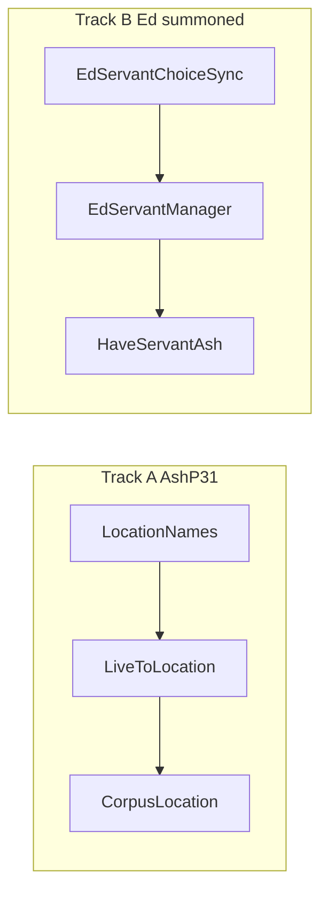

# Phase 67: AshP31 LOCATION + Ed servant summoned sync

> **For agentic workers:** REQUIRED SUB-SKILL: Use superpowers:subagent-driven-development (recommended) or superpowers:executing-plans to implement this plan task-by-task. Steps use checkbox (`- [ ]`) syntax for tracking.

**Goal:** Continue Tier 1 after Phase 66 (`REVISION = "phase66"`, 1,913 tests). Close remaining pass-through `to_location` string converter and deliver Ed choice 1053 summoned-list sync so `have_servant` / `servants` reflect live game state without manual `_edServants` pref seeding.

**Status:** Complete (`GameRuntimeLibrary.REVISION = "phase67"`)

**Architecture:** Track A adds `LocationNames` fuzzy resolver and wires live `to_location` in `registerTypeConversions` (delegating to `resolveLocation` + `LocationNames`). Track B ports desktop `EdServantData.inspectServants` choice-1053 HTML patterns into `EdServantChoiceSync`, hooked from `EdServantManager.switchServant` and `visitKolPage` edbase responses.

**Tech Stack:** Kotlin Multiplatform (`shared/commonMain` + `commonTest`), `LocationDatabase` / `AdventureDatabase`, `EdServantManager`, `./gradlew.bat :shared:jvmTest`, `./gradlew.bat :androidApp:assembleDebug`, `GameRuntimeLibrary.REVISION = "phase67"`.

**Authority:** [`docs/parity-audit.md`](docs/parity-audit.md) Tier 1 #1 (ASH behavioral / `to_*` resolvers) and Tier 1 #2 (Ed servant runtime depth).

---

## Track A — AshP31 live `to_location`

`registerTypeConversions` `to_location` previously passed the raw string through. AshP11 already owns live `is_valid` for LOCATION via `resolveLocation()`.

### Resolver

[`modifiers/LocationNames.kt`](shared/src/commonMain/kotlin/net/sourceforge/kolmafia/modifiers/LocationNames.kt):
- `resolve(name)` — exact/snarfblat lookup on `LocationDatabase`, `AdventureDatabase`, single substring match
- `isValid(name)`

### Wire converter

`registerTypeConversions` calls `resolveLocation(input)?.name ?: LocationNames.resolve(input)`; invalid/`none` → `""`.

Also fixed `resolveLocation` vacuous `"".all { isDigit() }` bug (empty string no longer resolves as snarfblat).

### Tests

- [`GameRuntimeLibraryAshP31Test.kt`](shared/src/commonTest/kotlin/net/sourceforge/kolmafia/ash/GameRuntimeLibraryAshP31Test.kt)
- [`AshCompatibilityCorpusTest.kt`](shared/src/commonTest/kotlin/net/sourceforge/kolmafia/ash/AshCompatibilityCorpusTest.kt): `corpus_locationEntity_live`

---

## Track B — Ed servant summoned list sync

`have_servant` reads `EdServantManager.getSummonedTypes()` from `_edServants` pref; Phase 66 added charpane active-servant sync only.

### Parser

[`servant/EdServantChoiceSync.kt`](shared/src/commonMain/kotlin/net/sourceforge/kolmafia/servant/EdServantChoiceSync.kt):
- Desktop `FREED_PATTERN` / `BUSY_PATTERN` → `ServantData.typeForId`
- `parseSummonedTypes(html)` / `parse(html)` with active type from busy row

### Integration

- `EdServantManager.syncFromChoice1053(html)` — updates `_edServants` + active servant from busy row
- Hook after door + choice HTTP in `switchServant`
- Hook on `visitKolPage` when path contains `edbase` and HTML has choice 1053

### Tests

- [`EdServantChoiceSyncTest.kt`](shared/src/commonTest/kotlin/net/sourceforge/kolmafia/servant/EdServantChoiceSyncTest.kt)
- [`GameRuntimeLibraryAshP26Test.kt`](shared/src/commonTest/kotlin/net/sourceforge/kolmafia/ash/GameRuntimeLibraryAshP26Test.kt): `haveServant_trueAfterChoice1053SyncWithoutManualPref`

**Deferred:** per-servant level/XP prefs, combat XP increment, full HTML table formatting in `servants` CLI.

---

## Closeout

| Item | Action |
|------|--------|
| `GameRuntimeLibrary.REVISION` | `"phase67"` |
| Plan doc | this file |
| [`docs/parity-audit.md`](docs/parity-audit.md) | Tier 1 #1 AshP31 struck; Ed choice-1053 summoned sync; Phase 67 history + test count |
| Verify | `.\gradlew.bat :shared:jvmTest` ; `.\gradlew.bat :androidApp:assembleDebug` |

---

## Deferred (Phase 68+)

- Low-key tower adventure-key auto-fetch in `TowerDoorRunner.retrieveKey`
- Tier 2 Maximizer unified `Evaluator.java` port
- Monster entity `numeric_modifier` depth (no bundled monster modifier data)
- PvP / `user_confirm` interactive stubs (explicit non-goals per audit)
